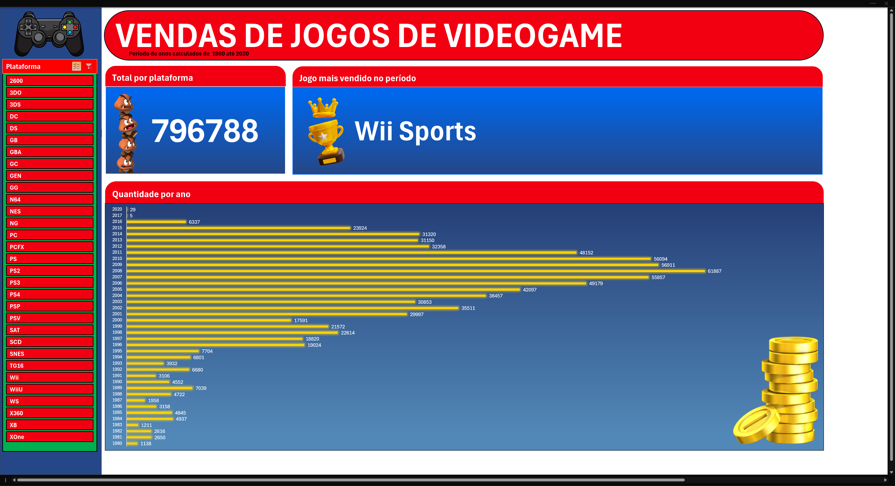

# 🎮 Dashboard de venda de jogos para videogames

Projeto de análise de vendas de videogames utilizando Excel.

## 📊 Objetivo

Analisar dados históricos de vendas de jogos.

## 📁 Dataset

Fonte dos dados:
https://www.kaggle.com/datasets/gregorut/videogamesales

O dataset contém informações como:

* Rank
* Nome do jogo
* Plataforma
* Ano de lançamento
* Gênero
* Distribuidora
* Vendas na América do Norte
* Vendas na Europa
* Vendas no Japão
* Outras vendas
* Vendas globais

## 📈 Dashboard

O dashboard foi construído no Excel e apresenta:

* Quantidade de vendas por plataforma e ano
* Jogo mais vendido no período de anos
* Total de vendas no período de anos

## 🛠 Ferramentas utilizadas

* Microsoft Excel
* Tabelas dinâmicas
* Gráficos dinâmicos
* Segmentação de dados

## 📷 Preview

